# 🏗️ Cognimend Architecture Documentation

> Deep dive into the system design, patterns, and technical decisions

---

## Table of Contents

1. [System Overview](#system-overview)
2. [Service Architecture](#service-architecture)
3. [Data Architecture](#data-architecture)
4. [Autonomous Operations](#autonomous-operations)
5. [RAG Pipeline](#rag-pipeline)
6. [Scalability Design](#scalability-design)
7. [Security Architecture](#security-architecture)
8. [Observability](#observability)
9. [Deployment Architecture](#deployment-architecture)
10. [Technology Decisions](#technology-decisions)

---

## System Overview

### High-Level Architecture

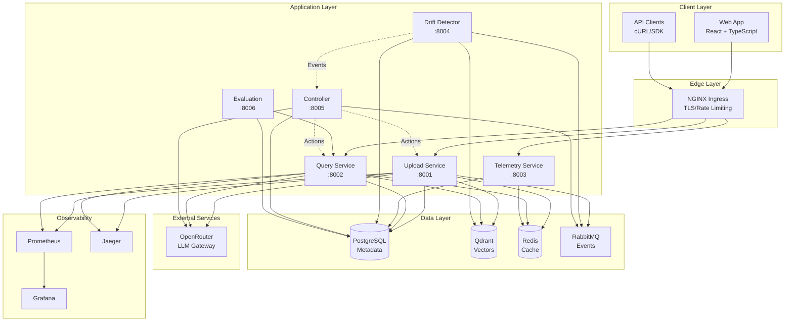

### Component Interactions

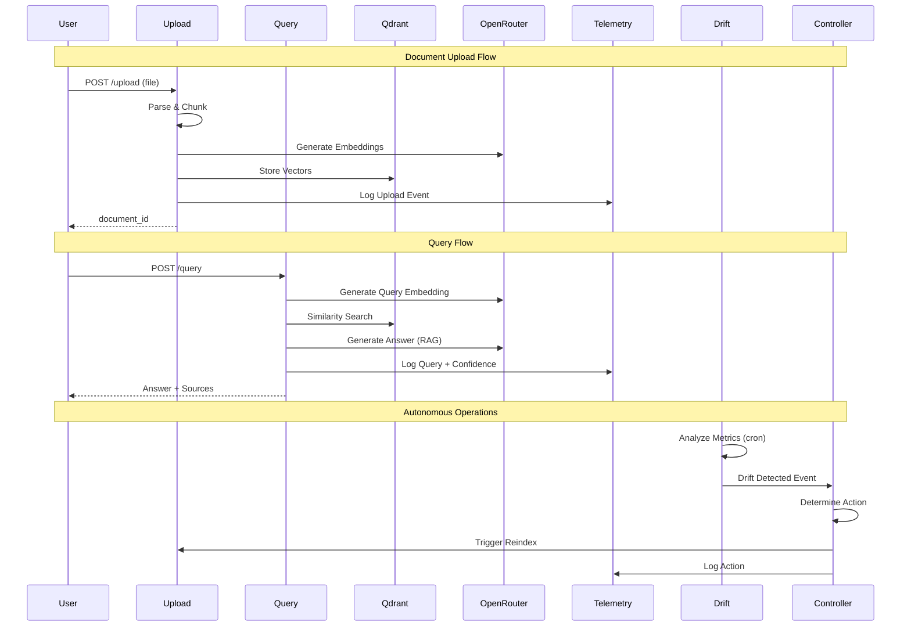

### Data Flow

```
┌─────────────────────────────────────────────────────────────────────────────┐
│                              DATA FLOW OVERVIEW                              │
└─────────────────────────────────────────────────────────────────────────────┘

1. DOCUMENT INGESTION
   ┌──────────┐    ┌───────────┐    ┌───────────┐    ┌───────────┐
   │  Upload  │───►│   Parse   │───►│  Chunk    │───►│ Embed     │
   │  (PDF)   │    │ (PyPDF2)  │    │ (tiktoken)│    │(OpenRouter)│
   └──────────┘    └───────────┘    └───────────┘    └─────┬─────┘
                                                           │
   ┌──────────────────────────────────────────────────────┘
   │
   ▼
   ┌───────────┐    ┌───────────┐
   │  Qdrant   │    │PostgreSQL │
   │ (vectors) │    │(metadata) │
   └───────────┘    └───────────┘

2. QUERY PROCESSING
   ┌──────────┐    ┌───────────┐    ┌───────────┐    ┌───────────┐
   │  Query   │───►│   Embed   │───►│  Search   │───►│  Generate │
   │  (text)  │    │(OpenRouter)│   │ (Qdrant)  │    │  (LLM)    │
   └──────────┘    └───────────┘    └───────────┘    └─────┬─────┘
                                                           │
   ┌──────────────────────────────────────────────────────┘
   │
   ▼
   ┌───────────┐    ┌───────────┐    ┌───────────┐
   │  Answer   │───►│ Telemetry │───►│   Cache   │
   │ +Sources  │    │  Logging  │    │  (Redis)  │
   └───────────┘    └───────────┘    └───────────┘

3. AUTONOMOUS MONITORING
   ┌──────────┐    ┌───────────┐    ┌───────────┐    ┌───────────┐
   │Telemetry │───►│   Drift   │───►│Controller │───►│  Action   │
   │  Data    │    │ Detection │    │  Decide   │    │  Execute  │
   └──────────┘    └───────────┘    └───────────┘    └───────────┘
```

---

## Service Architecture

### Microservices Overview

| Service | Port | Responsibility | Dependencies |
|---------|------|----------------|--------------|
| **Upload** | 8001 | Document ingestion, parsing, chunking, embedding | PostgreSQL, Qdrant, Redis, OpenRouter |
| **Query** | 8002 | RAG queries, answer generation, caching | PostgreSQL, Qdrant, Redis, OpenRouter |
| **Telemetry** | 8003 | Metrics aggregation, dashboard data | PostgreSQL, Redis |
| **Drift Detector** | 8004 | Statistical drift analysis | PostgreSQL, Qdrant |
| **Controller** | 8005 | Configuration management, auto-healing | PostgreSQL, All Services |
| **Evaluation** | 8006 | Benchmarking, quality testing | PostgreSQL, Query Service |

### Service Details

#### Upload Service (8001)

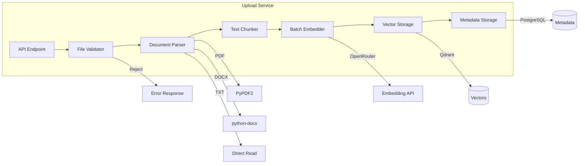

**Key Features:**
- Idempotency via file hashing (SHA-256)
- Batch embedding for efficiency (batch size: 100)
- Automatic retry with exponential backoff
- Circuit breaker for external services

#### Query Service (8002)

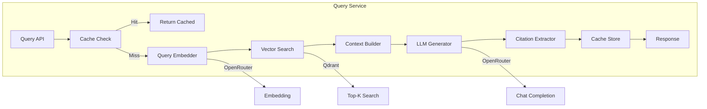

**Key Features:**
- Redis caching with 1-hour TTL
- Streaming responses via SSE
- Confidence scoring
- Source citation with page numbers

#### Drift Detector (8004)

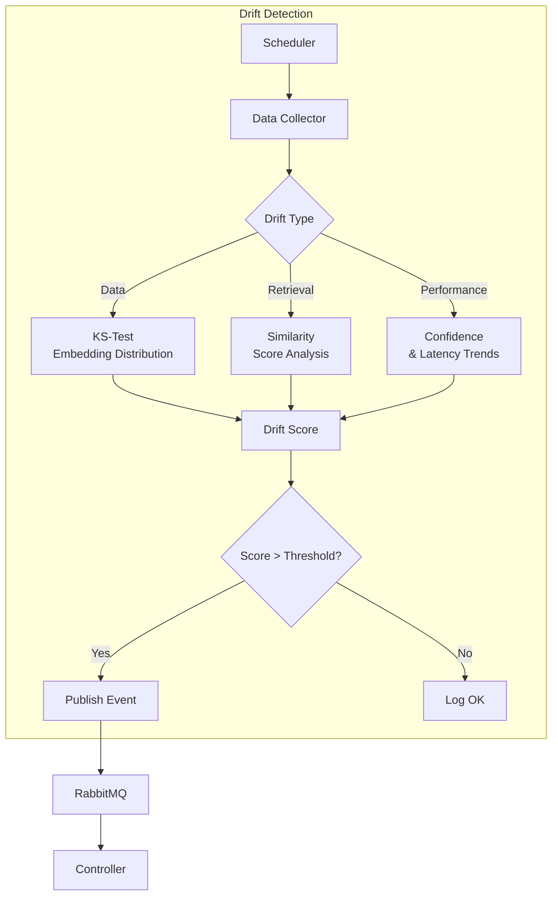

**Drift Types:**

| Type | Method | Threshold | Metric |
|------|--------|-----------|--------|
| Data Drift | Kolmogorov-Smirnov Test | 0.15 | Embedding distribution shift |
| Retrieval Drift | Mean Comparison | 0.10 | Similarity score degradation |
| Performance Drift | Trend Analysis | 0.05 | Confidence/latency change |

### Communication Patterns

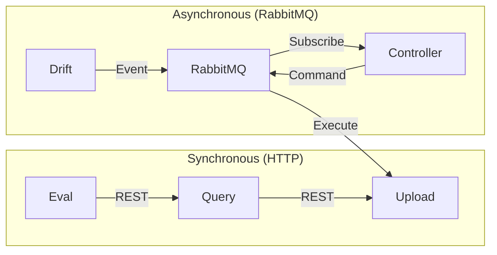

### API Contracts

All services follow OpenAPI 3.0 specification with:
- Consistent error response format
- Request/response validation via Pydantic
- Versioned endpoints (`/v1/`, `/v2/`)

---

## Data Architecture

### Database Schema (PostgreSQL)

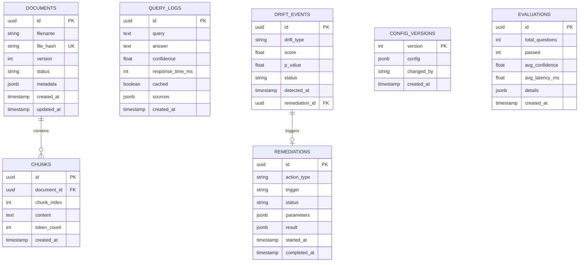

### Vector Storage (Qdrant)

**Collection: `documents`**

```json
{
  "collection_name": "documents",
  "vectors_config": {
    "size": 1536,
    "distance": "Cosine"
  },
  "optimizers_config": {
    "default_segment_number": 4,
    "indexing_threshold": 20000
  },
  "replication_factor": 1,
  "write_consistency_factor": 1
}
```

**Point Structure:**
```json
{
  "id": "chunk_uuid",
  "vector": [0.123, -0.456, ...],
  "payload": {
    "document_id": "doc_uuid",
    "document_name": "handbook.pdf",
    "chunk_index": 5,
    "content": "Text content...",
    "page": 12,
    "version": 2,
    "created_at": "2024-01-31T12:00:00Z"
  }
}
```

### Cache Strategy (Redis)

```
┌─────────────────────────────────────────────────────────────────┐
│                        REDIS CACHE LAYERS                        │
├─────────────────────────────────────────────────────────────────┤
│                                                                  │
│  Layer 1: Query Results (TTL: 1 hour)                           │
│  ┌─────────────────────────────────────────────────────────┐    │
│  │ Key: query:{hash}                                        │    │
│  │ Value: {answer, sources, confidence, metadata}           │    │
│  └─────────────────────────────────────────────────────────┘    │
│                                                                  │
│  Layer 2: Embeddings (TTL: 24 hours)                            │
│  ┌─────────────────────────────────────────────────────────┐    │
│  │ Key: embed:{text_hash}                                   │    │
│  │ Value: [0.123, -0.456, ...]                             │    │
│  └─────────────────────────────────────────────────────────┘    │
│                                                                  │
│  Layer 3: Dashboard Stats (TTL: 5 minutes)                      │
│  ┌─────────────────────────────────────────────────────────┐    │
│  │ Key: stats:dashboard                                     │    │
│  │ Value: {queries, documents, confidence, ...}            │    │
│  └─────────────────────────────────────────────────────────┘    │
│                                                                  │
│  Layer 4: Rate Limiting (TTL: 1 minute)                         │
│  ┌─────────────────────────────────────────────────────────┐    │
│  │ Key: ratelimit:{api_key}:{minute}                       │    │
│  │ Value: request_count                                     │    │
│  └─────────────────────────────────────────────────────────┘    │
│                                                                  │
└─────────────────────────────────────────────────────────────────┘
```

### Data Consistency Model

| Operation | Consistency | Rationale |
|-----------|-------------|-----------|
| Document Upload | Strong | Critical for search accuracy |
| Query Response | Eventual | Caching acceptable |
| Telemetry Logs | Eventual | Non-critical, high volume |
| Config Updates | Strong | Requires immediate effect |
| Drift Events | At-least-once | RabbitMQ acknowledgment |

---

## Autonomous Operations

### Drift Detection Algorithms

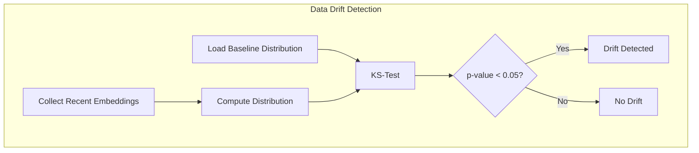

**Kolmogorov-Smirnov Test Implementation:**

```python
from scipy import stats
import numpy as np

def detect_data_drift(recent_embeddings, baseline_embeddings):
    """
    Detect drift using KS-test on embedding distributions.
    
    Returns: (is_drift, ks_statistic, p_value)
    """
    # Reduce dimensionality for comparison
    recent_norms = np.linalg.norm(recent_embeddings, axis=1)
    baseline_norms = np.linalg.norm(baseline_embeddings, axis=1)
    
    # Perform KS-test
    ks_stat, p_value = stats.ks_2samp(recent_norms, baseline_norms)
    
    is_drift = ks_stat > 0.15 and p_value < 0.05
    return is_drift, ks_stat, p_value
```

### Auto-Healing Workflows

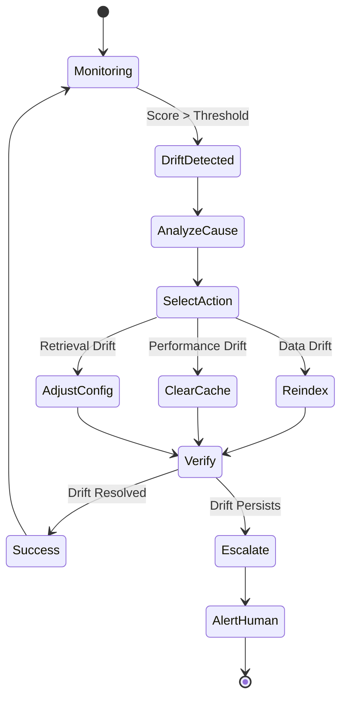

**Auto-Healing Actions:**

| Trigger | Action | Parameters |
|---------|--------|------------|
| Data Drift | Reindex Documents | `affected_doc_ids`, `batch_size` |
| Retrieval Drift | Clear Cache + Reindex | `ttl_override` |
| Performance Drift | Adjust Config | `cache_ttl`, `top_k` |
| Repeated Failures | Escalate to Human | `alert_channel` |

### Telemetry Collection

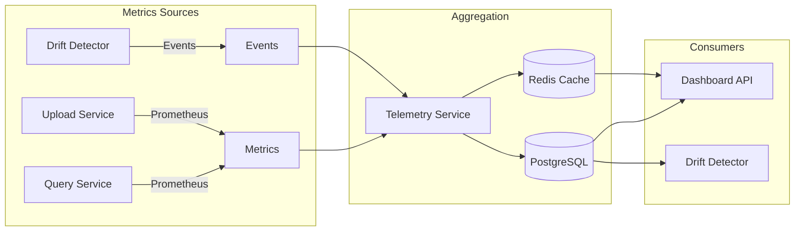

### Evaluation Framework

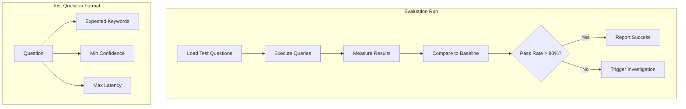

---

## RAG Pipeline

### Document Processing Flow

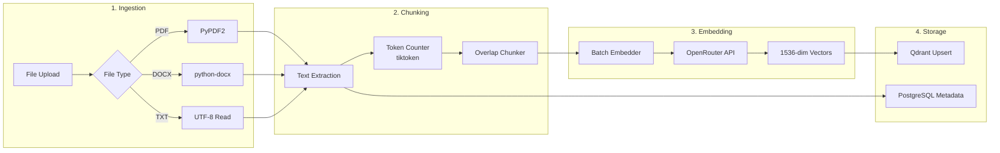

### Chunking Strategy

```python
class ChunkingConfig:
    CHUNK_SIZE = 512       # tokens
    CHUNK_OVERLAP = 50     # tokens
    MIN_CHUNK_SIZE = 100   # tokens
    SEPARATOR = "\n\n"     # paragraph boundary
```

**Algorithm:**
1. Split text on paragraph boundaries
2. Merge small paragraphs until `CHUNK_SIZE` reached
3. Add `CHUNK_OVERLAP` tokens from previous chunk
4. Discard chunks smaller than `MIN_CHUNK_SIZE`

### Embedding Generation

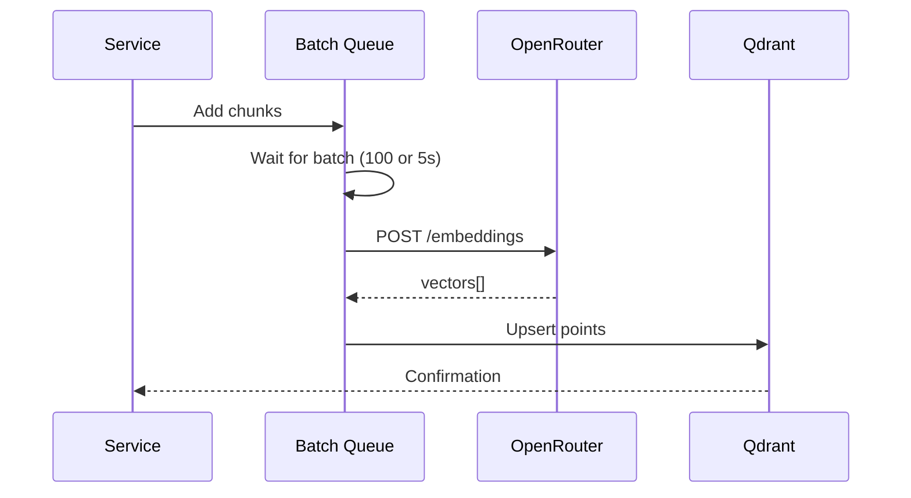

**Embedding Model:** `text-embedding-3-small` (1536 dimensions)

### Vector Search

```python
def search_similar(query_embedding: List[float], top_k: int = 5):
    """
    Search for similar documents using cosine similarity.
    """
    return qdrant_client.search(
        collection_name="documents",
        query_vector=query_embedding,
        limit=top_k,
        score_threshold=0.5,  # Minimum similarity
        with_payload=True
    )
```

### Answer Generation

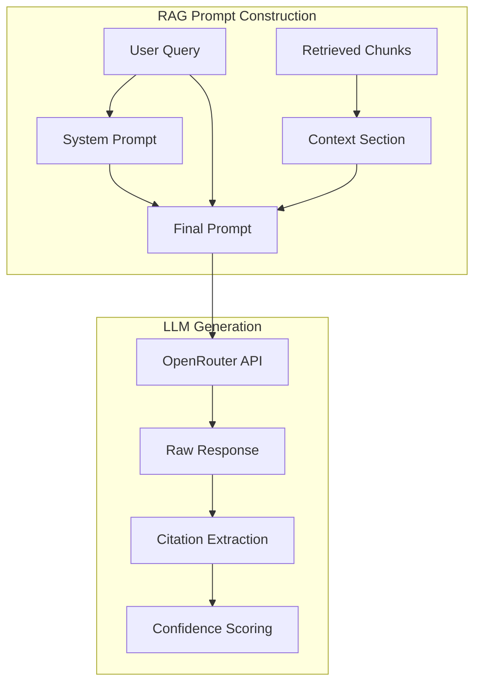

**Prompt Template:**
```
You are a helpful assistant that answers questions based on the provided context.

CONTEXT:
{chunks with source attribution}

RULES:
1. Only use information from the context
2. Cite sources using [Source: document_name, page X]
3. If unsure, say "I cannot find this information"
4. Be concise but complete

QUESTION: {user_query}

ANSWER:
```

### Citation Extraction

```python
def extract_citations(answer: str, sources: List[dict]) -> List[Citation]:
    """
    Extract and validate citations from LLM response.
    """
    citation_pattern = r'\[Source: ([^,]+), page (\d+)\]'
    matches = re.findall(citation_pattern, answer)
    
    citations = []
    for doc_name, page in matches:
        source = find_source(sources, doc_name, int(page))
        if source:
            citations.append(Citation(
                document_id=source['document_id'],
                document_name=doc_name,
                page=int(page),
                snippet=source['content'][:200],
                similarity=source['score']
            ))
    return citations
```

---

## Scalability Design

### Horizontal Scaling Strategy

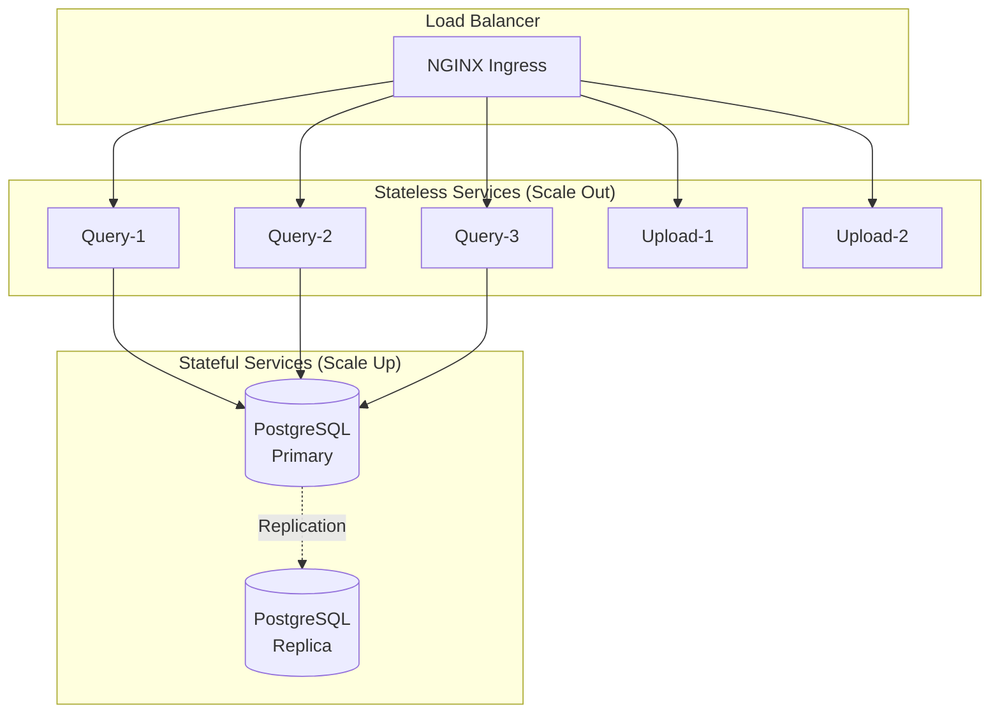

### Auto-Scaling Configuration

```yaml
# Horizontal Pod Autoscaler
apiVersion: autoscaling/v2
kind: HorizontalPodAutoscaler
metadata:
  name: query-hpa
spec:
  scaleTargetRef:
    apiVersion: apps/v1
    kind: Deployment
    name: query-service
  minReplicas: 3
  maxReplicas: 10
  metrics:
    - type: Resource
      resource:
        name: cpu
        target:
          type: Utilization
          averageUtilization: 70
    - type: Resource
      resource:
        name: memory
        target:
          type: Utilization
          averageUtilization: 80
```

### Caching Layers

```
┌─────────────────────────────────────────────────────────────────┐
│                     CACHING ARCHITECTURE                         │
├─────────────────────────────────────────────────────────────────┤
│                                                                  │
│  L1: Application Cache (in-memory)                              │
│  ├── Query embeddings (LRU, 1000 items)                        │
│  └── Config cache (5 min TTL)                                   │
│                                                                  │
│  L2: Redis Cache (distributed)                                  │
│  ├── Query results (1 hour TTL)                                 │
│  ├── Embeddings (24 hour TTL)                                   │
│  └── Dashboard stats (5 min TTL)                                │
│                                                                  │
│  L3: Database Query Cache (PostgreSQL)                          │
│  └── Prepared statements                                        │
│                                                                  │
│  L4: Vector Index Cache (Qdrant)                                │
│  └── HNSW index in memory                                       │
│                                                                  │
└─────────────────────────────────────────────────────────────────┘
```

### Rate Limiting

```python
class RateLimiter:
    """Token bucket rate limiter using Redis."""
    
    def __init__(self, redis_client, key_prefix="ratelimit"):
        self.redis = redis_client
        self.prefix = key_prefix
    
    async def check_rate_limit(
        self, 
        api_key: str, 
        limit: int = 60, 
        window: int = 60
    ) -> tuple[bool, int]:
        """
        Check if request is within rate limit.
        Returns: (allowed, remaining)
        """
        key = f"{self.prefix}:{api_key}:{int(time.time()) // window}"
        
        current = await self.redis.incr(key)
        if current == 1:
            await self.redis.expire(key, window)
        
        allowed = current <= limit
        remaining = max(0, limit - current)
        
        return allowed, remaining
```

---

## Security Architecture

### Authentication & Authorization

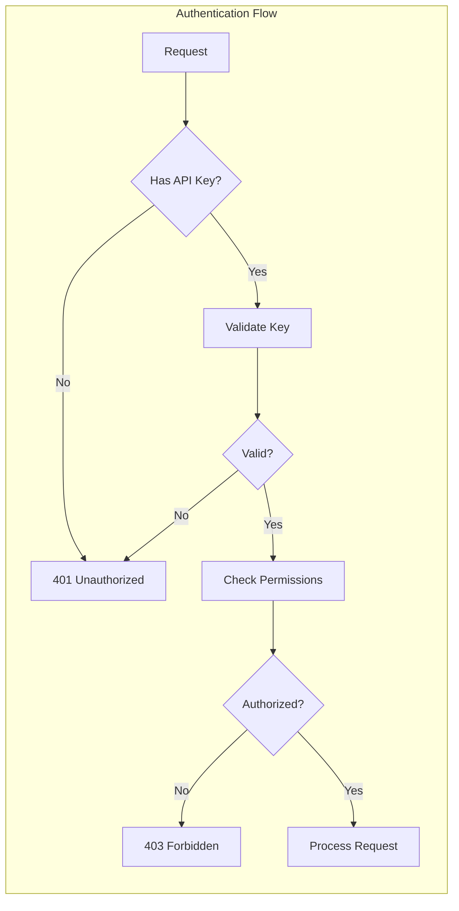

### API Key Management

```python
class APIKeyManager:
    """Secure API key validation and management."""
    
    def __init__(self, redis_client):
        self.redis = redis_client
        self.key_prefix = "apikey"
    
    def hash_key(self, api_key: str) -> str:
        """Hash API key for storage."""
        return hashlib.sha256(api_key.encode()).hexdigest()
    
    async def validate_key(self, api_key: str) -> Optional[APIKeyInfo]:
        """Validate API key and return permissions."""
        key_hash = self.hash_key(api_key)
        data = await self.redis.hgetall(f"{self.key_prefix}:{key_hash}")
        
        if not data:
            return None
        
        return APIKeyInfo(
            key_id=data['id'],
            permissions=json.loads(data['permissions']),
            rate_limit=int(data['rate_limit']),
            expires_at=datetime.fromisoformat(data['expires_at'])
        )
```

### Network Policies

```yaml
# Zero-trust network policy
apiVersion: networking.k8s.io/v1
kind: NetworkPolicy
metadata:
  name: query-service-policy
spec:
  podSelector:
    matchLabels:
      app: query-service
  policyTypes:
    - Ingress
    - Egress
  ingress:
    - from:
        - podSelector:
            matchLabels:
              app: ingress-nginx
      ports:
        - port: 8002
  egress:
    - to:
        - podSelector:
            matchLabels:
              app: postgres
      ports:
        - port: 5432
    - to:
        - podSelector:
            matchLabels:
              app: qdrant
      ports:
        - port: 6333
    - to:
        - podSelector:
            matchLabels:
              app: redis
      ports:
        - port: 6379
```

### Data Encryption

| Layer | Encryption | Method |
|-------|------------|--------|
| Transit | TLS 1.3 | Ingress termination |
| At Rest (PostgreSQL) | AES-256 | Transparent Data Encryption |
| At Rest (Qdrant) | AES-256 | Volume encryption |
| Secrets | Base64 + K8s | Kubernetes Secrets |

### Secrets Management

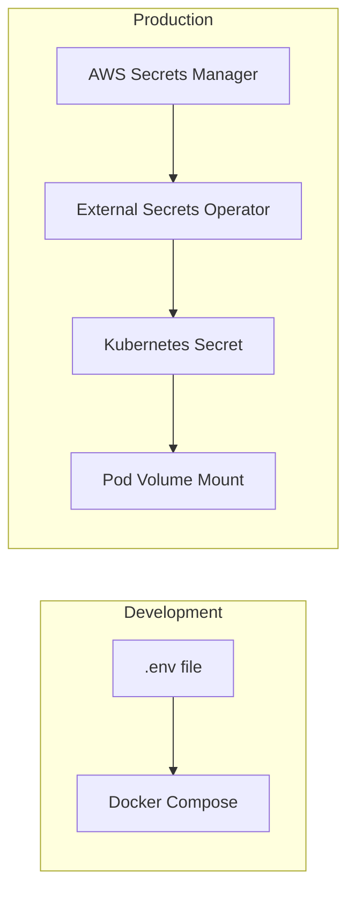

---

## Observability

### Metrics Collection

```mermaid
graph LR
    subgraph "Application Metrics"
        A[FastAPI] --> B[prometheus-client]
        B --> C[/metrics endpoint]
    end
    
    subgraph "Collection"
        C --> D[Prometheus]
        D --> E[AlertManager]
        D --> F[Grafana]
    end
    
    subgraph "Custom Metrics"
        G[query_latency_seconds]
        H[cache_hit_rate]
        I[confidence_score]
        J[drift_score]
    end
```

**Key Metrics:**

| Metric | Type | Labels | Description |
|--------|------|--------|-------------|
| `http_requests_total` | Counter | method, path, status | Total HTTP requests |
| `http_request_duration_seconds` | Histogram | method, path | Request latency |
| `rag_query_confidence` | Gauge | - | Last query confidence |
| `rag_cache_hits_total` | Counter | - | Cache hit count |
| `rag_drift_score` | Gauge | type | Drift detection score |
| `rag_documents_total` | Gauge | status | Document count |

### Logging Strategy

```python
# Structured logging with correlation
import logging
import json
from contextvars import ContextVar

request_id: ContextVar[str] = ContextVar('request_id', default='')

class JSONFormatter(logging.Formatter):
    def format(self, record):
        log_record = {
            "timestamp": self.formatTime(record),
            "level": record.levelname,
            "logger": record.name,
            "message": record.getMessage(),
            "request_id": request_id.get(),
            "service": "query-service"
        }
        if record.exc_info:
            log_record["exception"] = self.formatException(record.exc_info)
        return json.dumps(log_record)
```

**Log Levels:**

| Level | Use Case | Example |
|-------|----------|---------|
| ERROR | Failures requiring attention | Database connection failed |
| WARNING | Degraded performance | Cache miss, retry |
| INFO | Normal operations | Query completed |
| DEBUG | Development details | Embedding vector size |

### Distributed Tracing

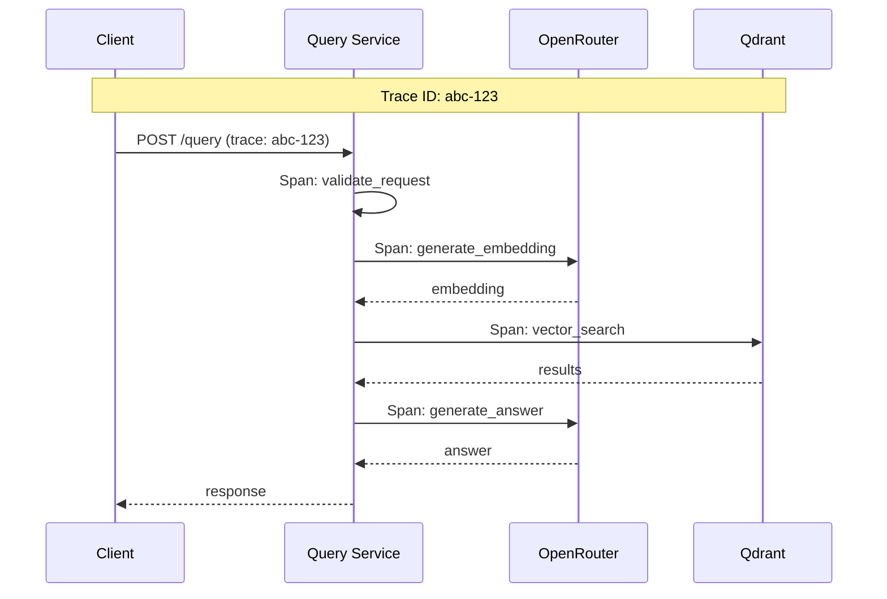

**OpenTelemetry Integration:**

```python
from opentelemetry import trace
from opentelemetry.instrumentation.fastapi import FastAPIInstrumentor
from opentelemetry.exporter.jaeger.thrift import JaegerExporter

# Initialize tracing
def init_tracing(service_name: str):
    tracer_provider = TracerProvider(
        resource=Resource.create({SERVICE_NAME: service_name})
    )
    tracer_provider.add_span_processor(
        BatchSpanProcessor(JaegerExporter(
            agent_host_name=os.getenv("JAEGER_HOST", "localhost"),
            agent_port=6831
        ))
    )
    trace.set_tracer_provider(tracer_provider)
    
    # Auto-instrument FastAPI
    FastAPIInstrumentor.instrument()
```

### Alerting System

```yaml
# PrometheusRule
groups:
  - name: cognimend-critical
    rules:
      - alert: HighErrorRate
        expr: |
          sum(rate(http_requests_total{status=~"5.."}[5m])) 
          / sum(rate(http_requests_total[5m])) > 0.05
        for: 5m
        labels:
          severity: critical
        annotations:
          summary: "High error rate detected"
          description: "Error rate is {{ $value | humanizePercentage }}"
```

---

## Deployment Architecture

### Kubernetes Resources

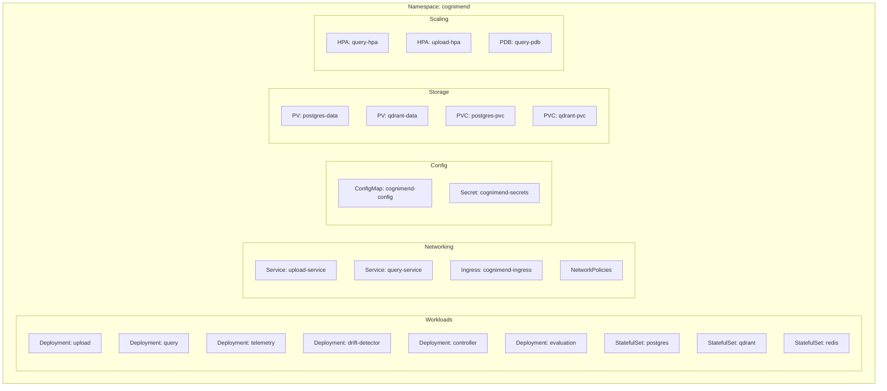

### Rolling Updates

```yaml
spec:
  strategy:
    type: RollingUpdate
    rollingUpdate:
      maxSurge: 1        # Create 1 new pod before killing old
      maxUnavailable: 0  # Never have less than desired replicas
```

### Canary Deployments

```mermaid
graph LR
    subgraph "Traffic Split"
        I[Ingress] --> |90%| S1[Stable v1.0]
        I --> |10%| S2[Canary v1.1]
    end
    
    subgraph "Promotion"
        M[Monitor Metrics] --> D{Success?}
        D -->|Yes| P[Promote Canary]
        D -->|No| R[Rollback]
    end
```

---

## Technology Decisions

### Why FastAPI?

| Criteria | FastAPI | Flask | Django |
|----------|---------|-------|--------|
| Async Support | ✅ Native | ❌ Requires ASGI | ❌ Limited |
| Performance | ⭐⭐⭐⭐⭐ | ⭐⭐⭐ | ⭐⭐ |
| Type Safety | ✅ Pydantic | ❌ Manual | ❌ Manual |
| Auto Docs | ✅ OpenAPI | ❌ Manual | ❌ Manual |
| Learning Curve | Easy | Easy | Medium |

**Decision:** FastAPI provides the best combination of performance, developer experience, and production-readiness for microservices.

### Why Qdrant vs Other Vector DBs?

| Feature | Qdrant | Pinecone | Milvus | Weaviate |
|---------|--------|----------|--------|----------|
| Self-hosted | ✅ | ❌ | ✅ | ✅ |
| Cloud Option | ✅ | ✅ | ✅ | ✅ |
| Filtering | ⭐⭐⭐⭐⭐ | ⭐⭐⭐ | ⭐⭐⭐⭐ | ⭐⭐⭐⭐ |
| Performance | ⭐⭐⭐⭐⭐ | ⭐⭐⭐⭐ | ⭐⭐⭐⭐ | ⭐⭐⭐ |
| Rust Backend | ✅ | ❌ | ❌ | ❌ |
| Memory Efficiency | ⭐⭐⭐⭐⭐ | ⭐⭐⭐ | ⭐⭐⭐ | ⭐⭐⭐ |

**Decision:** Qdrant offers excellent performance, rich filtering, and self-hosting capability with a small memory footprint.

### Why OpenRouter?

| Benefit | Description |
|---------|-------------|
| Multi-model Access | Access GPT-4, Claude, Llama, Mixtral through one API |
| Cost Optimization | Switch models based on cost/performance needs |
| Fallback Support | Automatic failover between providers |
| Single Integration | One SDK instead of multiple |

**Trade-offs:**
- Additional latency (~50ms)
- Dependency on third-party service
- Limited to supported models

### Trade-offs Made

| Decision | Trade-off | Rationale |
|----------|-----------|-----------|
| Microservices | Complexity vs Flexibility | Enables independent scaling and deployment |
| Redis Cache | Memory cost vs Latency | 80%+ cache hit rate justifies cost |
| Statistical Drift | Computation vs Accuracy | KS-test provides good balance |
| Async Everything | Complexity vs Throughput | Necessary for 250+ req/s target |
| Event-driven Healing | Eventual consistency | Autonomous operation more important than immediate |

---

## Appendix

### Glossary

| Term | Definition |
|------|------------|
| RAG | Retrieval Augmented Generation |
| KS-Test | Kolmogorov-Smirnov statistical test |
| HNSW | Hierarchical Navigable Small World (vector index) |
| HPA | Horizontal Pod Autoscaler |
| PDB | Pod Disruption Budget |

### References

- [FastAPI Documentation](https://fastapi.tiangolo.com/)
- [Qdrant Documentation](https://qdrant.tech/documentation/)
- [OpenRouter API](https://openrouter.ai/docs)
- [Kubernetes Best Practices](https://kubernetes.io/docs/concepts/cluster-administration/)
- [OpenTelemetry](https://opentelemetry.io/docs/)

---

**Last Updated:** January 2024  
**Version:** 2.0.0
