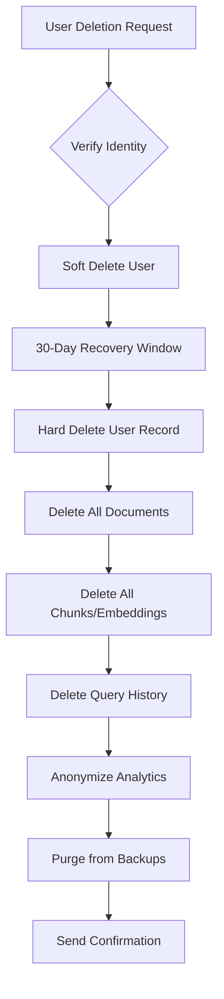

# DriftGuard Data Retention & Compliance Policy

## Document Control

| Version | Date | Author | Description |
|---------|------|--------|-------------|
| 1.0 | 2024-01-27 | DriftGuard Team | Initial policy |

## 1. Overview

This document defines DriftGuard's data retention policies and compliance requirements for GDPR, CCPA, and SOC 2 Type II compliance.

## 2. Data Classification

### 2.1 Data Categories

| Category | Description | Retention Period | Examples |
|----------|-------------|------------------|----------|
| **Critical** | Highly sensitive business data | As required + 7 years | API keys, credentials |
| **Confidential** | Sensitive user/business data | 3 years after deletion request | User documents, queries |
| **Internal** | Operational data | 1 year | Logs, metrics, traces |
| **Public** | Non-sensitive data | Indefinite | Documentation, public API specs |

### 2.2 Personal Data Inventory

| Data Type | Purpose | Legal Basis | Retention |
|-----------|---------|-------------|-----------|
| Email addresses | Account identification | Contract | Account lifetime + 30 days |
| IP addresses | Security, rate limiting | Legitimate interest | 90 days |
| Query history | Service improvement | Consent | 1 year or until withdrawal |
| Document content | Core service | Contract | Until deletion request |
| Usage analytics | Service improvement | Legitimate interest | 2 years (anonymized) |

## 3. Retention Schedules

### 3.1 Operational Data

```yaml
logs:
  application_logs: 30 days
  security_logs: 1 year
  audit_logs: 7 years
  access_logs: 90 days

metrics:
  high_resolution: 15 days (1-minute intervals)
  medium_resolution: 90 days (5-minute intervals)
  low_resolution: 2 years (1-hour intervals)

traces:
  full_traces: 7 days
  sampled_traces: 30 days
  error_traces: 90 days

backups:
  daily_backups: 30 days
  weekly_backups: 90 days
  monthly_backups: 1 year
  annual_backups: 7 years
```

### 3.2 User Data

```yaml
user_accounts:
  active_accounts: Indefinite (while active)
  inactive_accounts: 2 years after last activity
  deleted_accounts: 30 days (soft delete) + immediate (hard delete)

documents:
  active_documents: Until user deletion
  deleted_documents: 30 days recovery window
  document_metadata: 90 days after document deletion

queries:
  query_history: 1 year
  query_results_cache: 24 hours
  anonymous_query_analytics: 2 years
```

## 4. GDPR Compliance

### 4.1 Data Subject Rights

| Right | Implementation | Response Time |
|-------|----------------|---------------|
| **Access** | Data export API | 30 days |
| **Rectification** | Self-service + support | 72 hours |
| **Erasure** | Deletion API + cascade | 30 days |
| **Portability** | JSON/CSV export | 30 days |
| **Restriction** | Processing flags | 72 hours |
| **Objection** | Opt-out mechanisms | 72 hours |

### 4.2 Data Export Format

```json
{
  "export_date": "2024-01-27T12:00:00Z",
  "data_subject": {
    "id": "user_xxx",
    "email": "user@example.com",
    "created_at": "2023-01-01T00:00:00Z"
  },
  "documents": [
    {
      "id": "doc_xxx",
      "filename": "example.pdf",
      "uploaded_at": "2023-06-15T10:30:00Z",
      "size_bytes": 1024000,
      "chunk_count": 42
    }
  ],
  "queries": [
    {
      "timestamp": "2024-01-15T14:22:00Z",
      "question": "What is...",
      "document_ids": ["doc_xxx"]
    }
  ],
  "consent_records": [
    {
      "type": "analytics",
      "granted": true,
      "timestamp": "2023-01-01T00:00:00Z"
    }
  ]
}
```

### 4.3 Privacy by Design

- **Data Minimization**: Only collect necessary data
- **Purpose Limitation**: Use data only for stated purposes
- **Storage Limitation**: Automatic deletion per retention schedules
- **Accuracy**: User self-service for corrections
- **Integrity & Confidentiality**: Encryption at rest and in transit

## 5. CCPA Compliance

### 5.1 Consumer Rights

| Right | Implementation |
|-------|----------------|
| **Right to Know** | Data access API, privacy dashboard |
| **Right to Delete** | Deletion API with 45-day response |
| **Right to Opt-Out** | Do Not Sell toggle, no data sales |
| **Right to Non-Discrimination** | Equal service for all users |

### 5.2 Notice at Collection

Required disclosures in privacy policy:
- Categories of personal information collected
- Purposes for collection
- Right to opt-out of sale (N/A - no sale)
- Retention periods

## 6. Data Processing Agreements

### 6.1 Sub-Processors

| Processor | Purpose | Location | DPA Status |
|-----------|---------|----------|------------|
| AWS | Infrastructure | US (EU region available) | ✅ Signed |
| OpenRouter | LLM API | US | ✅ Signed |
| Sentry | Error tracking | US | ✅ Signed |
| Grafana Cloud | Monitoring | EU | ✅ Signed |

### 6.2 DPA Requirements

All sub-processors must:
- Sign Standard Contractual Clauses (SCCs)
- Maintain SOC 2 Type II certification
- Provide 30-day breach notification
- Allow audit rights

## 7. Breach Response

### 7.1 Incident Classification

| Severity | Description | Notification |
|----------|-------------|--------------|
| **Critical** | Mass data exposure | 72 hours to DPA, immediate to users |
| **High** | Limited data exposure | 72 hours to DPA |
| **Medium** | Potential exposure | Internal escalation |
| **Low** | No data exposure | Log and monitor |

### 7.2 Response Timeline

```
T+0h    Incident detected
T+1h    Initial assessment
T+4h    Containment measures
T+24h   Root cause analysis
T+48h   Remediation plan
T+72h   Regulatory notification (if required)
T+168h  Post-incident review
```

## 8. Technical Implementation

### 8.1 Automated Retention Jobs

```yaml
# Kubernetes CronJobs for retention
retention_jobs:
  - name: purge-old-logs
    schedule: "0 3 * * *"  # Daily at 3 AM
    action: Delete logs older than retention period
  
  - name: anonymize-analytics
    schedule: "0 4 * * 0"  # Weekly on Sunday
    action: Anonymize user identifiers in old analytics
  
  - name: purge-deleted-users
    schedule: "0 5 * * *"  # Daily at 5 AM
    action: Hard delete users past soft-delete window
  
  - name: backup-cleanup
    schedule: "0 6 * * 0"  # Weekly on Sunday
    action: Remove backups past retention period
```

### 8.2 Data Deletion Cascade



### 8.3 Encryption Standards

| Data State | Encryption | Key Management |
|------------|------------|----------------|
| At Rest | AES-256-GCM | AWS KMS / Vault |
| In Transit | TLS 1.3 | Cert-Manager |
| Backups | AES-256-GCM | Separate backup keys |
| Logs | Field-level encryption | Log encryption keys |

## 9. Audit & Monitoring

### 9.1 Compliance Metrics

| Metric | Target | Alert Threshold |
|--------|--------|-----------------|
| DSAR response time | < 30 days | > 20 days |
| Deletion completion | < 30 days | > 25 days |
| Consent sync latency | < 1 hour | > 4 hours |
| Encryption coverage | 100% | < 100% |

### 9.2 Audit Trail

All data access and modifications are logged:
```json
{
  "timestamp": "2024-01-27T12:00:00Z",
  "action": "data_export",
  "actor": {
    "type": "user",
    "id": "user_xxx",
    "ip": "192.168.1.1"
  },
  "resource": {
    "type": "user_data",
    "id": "user_xxx"
  },
  "result": "success",
  "details": {
    "export_format": "json",
    "records_included": 150
  }
}
```

## 10. Annual Review

This policy is reviewed annually or upon:
- Significant changes to data processing
- New regulatory requirements
- Security incidents
- Audit findings

**Next Review Date**: January 2025

---

## Appendix A: Regulatory References

- GDPR: Regulation (EU) 2016/679
- CCPA: California Civil Code §1798.100-199
- SOC 2: AICPA Trust Services Criteria

## Appendix B: Contact Information

- **Data Protection Officer**: dpo@driftguard.io
- **Privacy Inquiries**: privacy@driftguard.io
- **Security Team**: security@driftguard.io
