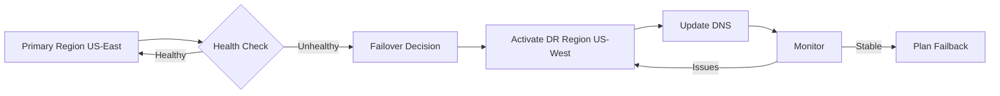

# DriftGuard Disaster Recovery Plan

## Document Control

| Version | Date | Author | Description |
|---------|------|--------|-------------|
| 1.0 | 2024-01-27 | DriftGuard Team | Initial DR plan |

## 1. Executive Summary

This document defines DriftGuard's Disaster Recovery (DR) procedures to ensure business continuity in the event of system failures, data loss, or catastrophic events.

### Key Metrics

| Metric | Target | Minimum Acceptable |
|--------|--------|-------------------|
| **RTO (Recovery Time Objective)** | 1 hour | 4 hours |
| **RPO (Recovery Point Objective)** | 15 minutes | 1 hour |
| **MTTR (Mean Time To Recovery)** | 30 minutes | 2 hours |
| **Availability SLA** | 99.9% | 99.5% |

## 2. Disaster Classifications

### 2.1 Severity Levels

| Level | Description | Examples | Response Time |
|-------|-------------|----------|---------------|
| **P1 - Critical** | Complete service outage | All services down, data center failure | Immediate |
| **P2 - High** | Major functionality impaired | Primary database failure, multi-service outage | < 15 minutes |
| **P3 - Medium** | Partial service degradation | Single service failure, performance issues | < 1 hour |
| **P4 - Low** | Minor issues | Non-critical component failure | < 4 hours |

### 2.2 Disaster Scenarios

| Scenario | Probability | Impact | Recovery Strategy |
|----------|-------------|--------|-------------------|
| Database corruption | Low | Critical | Point-in-time recovery |
| Kubernetes cluster failure | Low | Critical | Multi-region failover |
| Single service failure | Medium | High | Auto-scaling, restart |
| Network partition | Low | High | DNS failover |
| Data center outage | Very Low | Critical | Cross-region DR |
| Ransomware attack | Low | Critical | Isolated backup restore |
| DNS hijacking | Very Low | High | DNSSEC, alternate domains |

## 3. Recovery Procedures

### 3.1 Database Recovery

#### Point-in-Time Recovery (PITR)

```bash
#!/bin/bash
# PostgreSQL Point-in-Time Recovery

# 1. Stop current database
kubectl scale deployment postgres --replicas=0 -n driftguard-prod

# 2. Restore from backup
BACKUP_TIMESTAMP="${1:-$(date -d '1 hour ago' +%Y%m%d_%H%M%S)}"
aws s3 cp "s3://driftguard-backups/backups/postgres/${BACKUP_TIMESTAMP}/driftguard.sql.gz" /tmp/

# 3. Prepare recovery target
kubectl exec -it postgres-0 -- psql -U postgres -c "DROP DATABASE IF EXISTS driftguard_recovery;"
kubectl exec -it postgres-0 -- psql -U postgres -c "CREATE DATABASE driftguard_recovery;"

# 4. Restore backup
gunzip -c /tmp/driftguard.sql.gz | kubectl exec -i postgres-0 -- psql -U postgres -d driftguard_recovery

# 5. Apply WAL logs up to target time
kubectl exec -it postgres-0 -- bash -c "
  pg_restore --target-time='${TARGET_TIME}' \
    --target-action=promote \
    -d driftguard_recovery
"

# 6. Validate recovery
kubectl exec -it postgres-0 -- psql -U postgres -d driftguard_recovery -c "SELECT COUNT(*) FROM documents;"

# 7. Swap databases
kubectl exec -it postgres-0 -- psql -U postgres -c "ALTER DATABASE driftguard RENAME TO driftguard_old;"
kubectl exec -it postgres-0 -- psql -U postgres -c "ALTER DATABASE driftguard_recovery RENAME TO driftguard;"

# 8. Restart services
kubectl rollout restart deployment -n driftguard-prod
```

#### Validation Checklist

- [ ] Document count matches expected
- [ ] Recent queries return expected results
- [ ] User accounts accessible
- [ ] No data corruption detected
- [ ] Indexes rebuilt if necessary

### 3.2 Full Cluster Recovery

```bash
#!/bin/bash
# Full Kubernetes Cluster Recovery

# 1. Provision new cluster (if needed)
eksctl create cluster -f infrastructure/kubernetes/cluster-config.yaml

# 2. Install core components
kubectl apply -f infrastructure/kubernetes/namespace.yaml
kubectl apply -f infrastructure/kubernetes/external-secrets.yaml
kubectl apply -f infrastructure/kubernetes/rbac.yaml

# 3. Restore secrets from Vault/AWS
kubectl apply -f infrastructure/kubernetes/configmaps-secrets.yaml

# 4. Deploy infrastructure
kubectl apply -f infrastructure/kubernetes/redis-cluster.yaml
kubectl apply -f infrastructure/kubernetes/qdrant-cluster.yaml
kubectl apply -f infrastructure/kubernetes/prometheus.yaml
kubectl apply -f infrastructure/kubernetes/loki-stack.yaml

# 5. Wait for infrastructure
kubectl wait --for=condition=ready pod -l app=redis --timeout=300s
kubectl wait --for=condition=ready pod -l app=qdrant --timeout=300s

# 6. Restore database
./scripts/restore-database.sh

# 7. Restore Qdrant vectors
./scripts/restore-qdrant.sh

# 8. Deploy applications
kubectl apply -k infrastructure/kubernetes/overlays/production/

# 9. Wait for deployments
kubectl rollout status deployment/driftguard-controller -n driftguard-prod
kubectl rollout status deployment/driftguard-query -n driftguard-prod

# 10. Validate health
./scripts/health-check.sh

# 11. Update DNS (if failover)
./scripts/update-dns.sh
```

### 3.3 Single Service Recovery

```bash
#!/bin/bash
# Single Service Recovery

SERVICE_NAME="${1:-controller}"
NAMESPACE="driftguard-prod"

echo "Recovering service: ${SERVICE_NAME}"

# 1. Check current state
kubectl get pods -n ${NAMESPACE} -l app=driftguard-${SERVICE_NAME}
kubectl describe deployment driftguard-${SERVICE_NAME} -n ${NAMESPACE}

# 2. Force restart
kubectl rollout restart deployment driftguard-${SERVICE_NAME} -n ${NAMESPACE}

# 3. Wait for rollout
kubectl rollout status deployment driftguard-${SERVICE_NAME} -n ${NAMESPACE} --timeout=300s

# 4. Verify health
kubectl exec -it deploy/driftguard-${SERVICE_NAME} -n ${NAMESPACE} -- curl -s localhost:8000/health

# 5. Check logs for errors
kubectl logs -l app=driftguard-${SERVICE_NAME} -n ${NAMESPACE} --tail=100 | grep -i error

echo "Service ${SERVICE_NAME} recovery complete"
```

### 3.4 Data Corruption Recovery

```yaml
# Qdrant Vector Database Recovery
recovery_steps:
  1_assess:
    - Check Qdrant collection status
    - Identify corrupted segments
    - Document affected document IDs
  
  2_isolate:
    - Scale down query service
    - Create backup of current state
    - Enable maintenance mode
  
  3_restore:
    - Restore from latest snapshot
    - Or: Re-embed affected documents
    - Validate vector consistency
  
  4_verify:
    - Run integrity checks
    - Test sample queries
    - Compare results with known-good data
  
  5_resume:
    - Scale up query service
    - Monitor error rates
    - Disable maintenance mode
```

## 4. Failover Procedures

### 4.1 Multi-Region Failover



#### Failover Script

```bash
#!/bin/bash
# Automated Failover to DR Region

DR_REGION="us-west-2"
PRIMARY_REGION="us-east-1"

echo "Initiating failover to ${DR_REGION}..."

# 1. Verify DR readiness
aws eks --region ${DR_REGION} describe-cluster --name driftguard-dr

# 2. Sync final data
./scripts/sync-to-dr.sh

# 3. Promote DR database
aws rds promote-read-replica \
    --db-instance-identifier driftguard-db-dr \
    --region ${DR_REGION}

# 4. Update Kubernetes context
aws eks update-kubeconfig --name driftguard-dr --region ${DR_REGION}

# 5. Scale up DR workloads
kubectl scale deployment --replicas=3 -l app=driftguard -n driftguard-prod

# 6. Update Route53 for failover
aws route53 change-resource-record-sets \
    --hosted-zone-id ${HOSTED_ZONE} \
    --change-batch file://dns-failover.json

# 7. Invalidate CDN cache
aws cloudfront create-invalidation \
    --distribution-id ${CDN_ID} \
    --paths "/*"

# 8. Notify team
./scripts/notify-oncall.sh "Failover to ${DR_REGION} complete"

echo "Failover complete. Monitor dashboards."
```

### 4.2 Blue-Green Failover

```bash
#!/bin/bash
# Blue-Green Deployment Failover

CURRENT_ENV=$(kubectl get service driftguard-api -o jsonpath='{.spec.selector.version}')

if [ "$CURRENT_ENV" == "blue" ]; then
    NEW_ENV="green"
else
    NEW_ENV="blue"
fi

echo "Failing over from ${CURRENT_ENV} to ${NEW_ENV}"

# 1. Verify new environment is ready
kubectl get deployment driftguard-controller-${NEW_ENV} -o jsonpath='{.status.readyReplicas}'

# 2. Switch traffic
kubectl patch service driftguard-api -p "{\"spec\":{\"selector\":{\"version\":\"${NEW_ENV}\"}}}"

# 3. Verify switch
sleep 5
NEW_PODS=$(kubectl get endpoints driftguard-api -o jsonpath='{.subsets[0].addresses[*].targetRef.name}')
echo "Traffic now routing to: ${NEW_PODS}"
```

## 5. Communication Plan

### 5.1 Escalation Matrix

| Level | Timeframe | Contacts | Actions |
|-------|-----------|----------|---------|
| L1 | 0-15 min | On-call engineer | Acknowledge, assess, initial response |
| L2 | 15-30 min | Team lead, SRE | Join incident, coordinate response |
| L3 | 30-60 min | Engineering manager | Executive updates, resource allocation |
| L4 | 60+ min | VP Engineering, CTO | Strategic decisions, external comms |

### 5.2 Notification Templates

#### Internal Alert
```
🚨 INCIDENT ALERT - P{SEVERITY}

Service: {SERVICE_NAME}
Status: {STATUS}
Impact: {IMPACT_DESCRIPTION}
Started: {START_TIME}

Current Actions:
- {ACTION_1}
- {ACTION_2}

Join: #incident-{INCIDENT_ID}
```

#### Customer Communication
```
Subject: DriftGuard Service Disruption Update

Dear Customer,

We are currently experiencing a service disruption affecting {AFFECTED_FEATURES}.

Status: {STATUS}
Estimated Resolution: {ETA}

We apologize for the inconvenience and are working to resolve this as quickly as possible.

Updates will be posted at: https://status.driftguard.io

Thank you for your patience.
```

## 6. Testing & Validation

### 6.1 DR Testing Schedule

| Test Type | Frequency | Duration | Scope |
|-----------|-----------|----------|-------|
| Backup Restore | Weekly | 1 hour | Database, Qdrant |
| Service Failover | Monthly | 2 hours | Single service |
| Full DR Drill | Quarterly | 4 hours | Complete failover |
| Chaos Engineering | Continuous | Ongoing | Random failures |

### 6.2 DR Test Checklist

```yaml
pre_test:
  - [ ] Notify stakeholders of test window
  - [ ] Verify backup integrity
  - [ ] Document current state
  - [ ] Prepare rollback procedures

during_test:
  - [ ] Execute failover procedures
  - [ ] Measure RTO/RPO metrics
  - [ ] Document issues encountered
  - [ ] Test all critical functionality

post_test:
  - [ ] Restore to normal operations
  - [ ] Complete incident report
  - [ ] Update procedures based on findings
  - [ ] Schedule follow-up improvements
```

### 6.3 Chaos Engineering Tests

```yaml
chaos_experiments:
  - name: "Database Connection Failure"
    target: postgres
    action: network_partition
    duration: 5m
    expected_behavior: "Services use cached data, degrade gracefully"
    
  - name: "Redis Cache Failure"
    target: redis
    action: kill_pod
    duration: 10m
    expected_behavior: "Services fall back to database, higher latency"
    
  - name: "High Latency"
    target: qdrant
    action: add_latency_300ms
    duration: 15m
    expected_behavior: "Circuit breakers activate, fallback responses"
    
  - name: "Resource Exhaustion"
    target: controller
    action: stress_cpu_90
    duration: 5m
    expected_behavior: "HPA scales up, load balances across pods"
```

## 7. Recovery Runbooks

### Quick Reference

| Scenario | Runbook | Est. Time |
|----------|---------|-----------|
| Database down | [runbooks/database-recovery.md](../runbooks/service-recovery.md) | 30 min |
| Full outage | [runbooks/full-recovery.md](../runbooks/rollback.md) | 2 hours |
| High error rate | [runbooks/high-error-rate.md](../runbooks/high-error-rate.md) | 15 min |
| High latency | [runbooks/high-latency.md](../runbooks/high-latency.md) | 30 min |
| Security incident | [runbooks/security-incident.md](../runbooks/service-recovery.md) | Varies |

## 8. Post-Incident Procedures

### 8.1 Incident Report Template

```markdown
# Incident Report: {INCIDENT_ID}

## Summary
- **Date**: {DATE}
- **Duration**: {DURATION}
- **Severity**: {SEVERITY}
- **Services Affected**: {SERVICES}
- **Customer Impact**: {IMPACT}

## Timeline
| Time | Event |
|------|-------|
| HH:MM | Incident detected |
| HH:MM | Team notified |
| HH:MM | Root cause identified |
| HH:MM | Fix implemented |
| HH:MM | Service restored |

## Root Cause
{DETAILED_ROOT_CAUSE}

## Resolution
{RESOLUTION_STEPS}

## Lessons Learned
1. {LESSON_1}
2. {LESSON_2}

## Action Items
| Item | Owner | Due Date | Status |
|------|-------|----------|--------|
| {ACTION} | {OWNER} | {DATE} | {STATUS} |

## Prevention Measures
{PREVENTION_MEASURES}
```

### 8.2 Post-Incident Review Meeting

Agenda:
1. Timeline review (10 min)
2. Root cause analysis (20 min)
3. What went well (10 min)
4. Areas for improvement (15 min)
5. Action items assignment (10 min)

## 9. Maintenance & Updates

### 9.1 Document Review Schedule

| Section | Review Frequency | Owner |
|---------|-----------------|-------|
| Contact lists | Monthly | Ops Lead |
| Runbooks | Quarterly | SRE Team |
| DR procedures | Quarterly | Engineering Lead |
| Full document | Annually | CTO |

### 9.2 Change Log

| Date | Version | Changes | Author |
|------|---------|---------|--------|
| 2024-01-27 | 1.0 | Initial document | DriftGuard Team |

---

## Appendix A: Contact Information

### On-Call Schedule
- Primary: [PagerDuty Schedule](https://pagerduty.com)
- Secondary: [Backup Schedule](https://pagerduty.com)

### External Contacts
| Vendor | Contact | Purpose |
|--------|---------|---------|
| AWS Support | support@aws.com | Infrastructure issues |
| CloudFlare | emergency@cloudflare.com | CDN/DNS issues |
| OpenRouter | support@openrouter.ai | LLM API issues |

## Appendix B: Recovery Commands Cheatsheet

```bash
# Quick health check
kubectl get pods -n driftguard-prod -o wide

# Force restart all services
kubectl rollout restart deployment -n driftguard-prod

# Scale up replicas
kubectl scale deployment --all --replicas=5 -n driftguard-prod

# View recent logs
kubectl logs -l app=driftguard --since=1h -n driftguard-prod | tail -100

# Check database connectivity
kubectl exec -it deploy/driftguard-controller -- python -c "import psycopg2; print('DB OK')"

# Check Redis connectivity
kubectl exec -it deploy/driftguard-controller -- python -c "import redis; print('Redis OK')"
```
